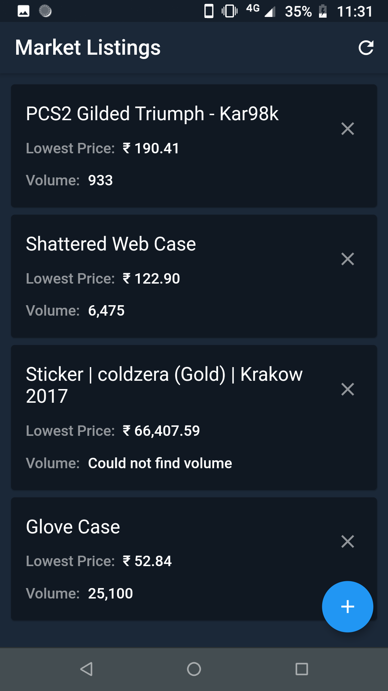
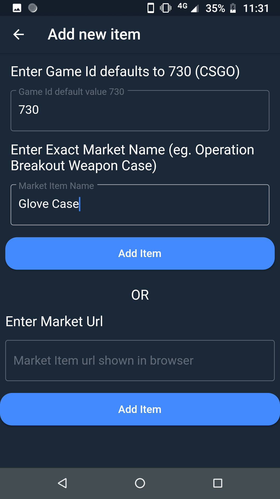

<h1 align="center">Steam Market Tracker</h1>

    

* Track indvidual item prices on steam market easily.
* Easily add new items via market url

<h3 align="center">Preview Screenshots</h3>
<table>
<tr>
    <td>
        
    </td>
    <td>
        
    </td>
</tr>
</table>
