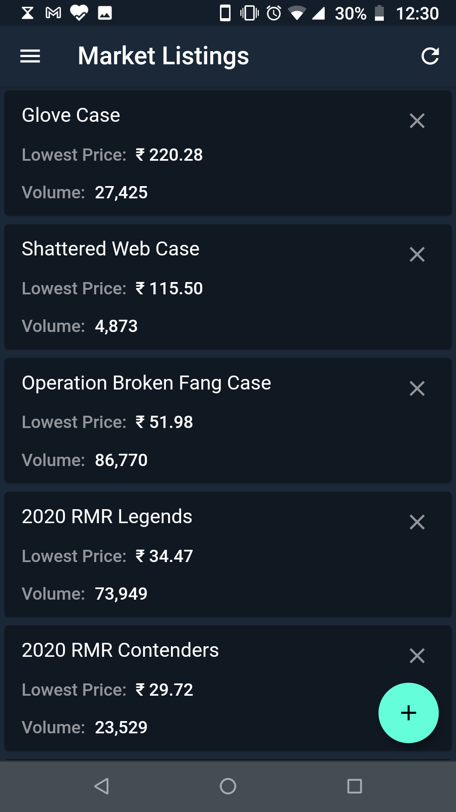

<h1 align="center">Steam Market Tracker</h1>

    

* Track indvidual item prices on steam market easily.
* Easily add new items via market url

<h3 align="center">Preview Screenshots</h3>
<table>
<tr>
    <td>
        
    </td>
    <td>
        
    </td>
</tr>
</table>

## Help
* What does a market url look like ?
>> It is the url shown in your browser when you view an item on steam market [eg.](https://steamcommunity.com/market/listings/730/%E2%98%85%20Huntsman%20Knife%20%7C%20Crimson%20Web%20(Factory%20New))
* How do i find my game id?
>> Take the following url [https://steamcommunity.com/market/listings/730/Fracture%20Case](https://steamcommunity.com/market/listings/730/Fracture%20Case)
>> The number `730` represents the game id and the following string represents the `item name`.
